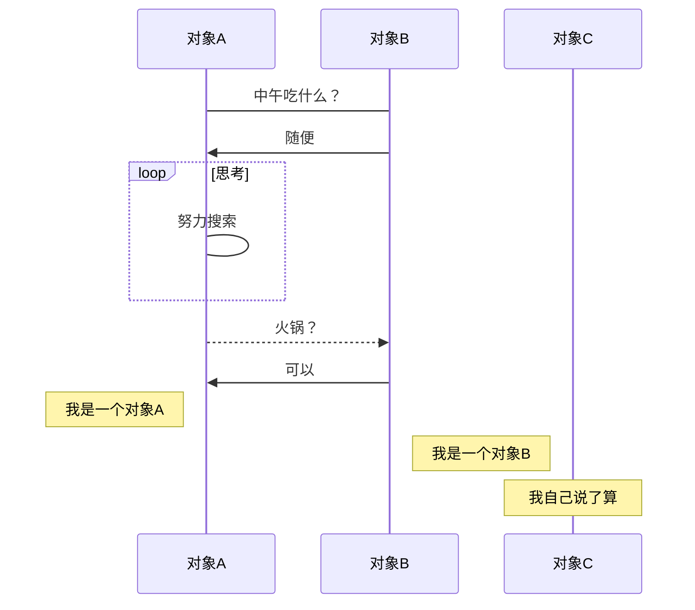
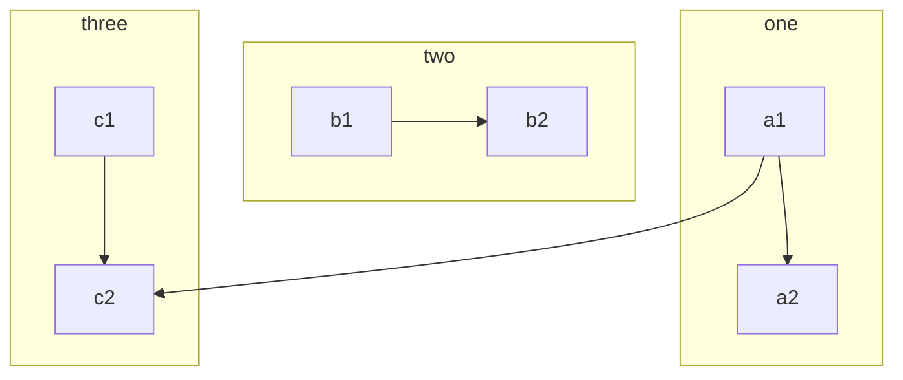

```sequence 
hello->hi:
Note left of hi: 你好
```

# fdffadsf
##dfdf

```puml
 A->B
 Note left of B: 你好
```


```plantuml
 digraph Test {
    A->B
 }
```


```mermaid
sequenceDiagram
对象A->对象B:中午吃什么？
对象B->>对象A: 随便
loop 思考
    对象A->对象A: 努力搜索
end
对象A-->>对象B: 火锅？
对象B->>对象A: 可以
Note left of 对象A: 我是一个对象A
Note right of 对象B: 我是一个对象B
participant 对象C
Note over 对象C: 我自己说了算
```


```mermaid
graph TB  
    subgraph one
    a1 --> a2
    end
    subgraph two
    b1-->b2
    end
    subgraph three
    c1 --> c2
    end
    a1 --> c2
```