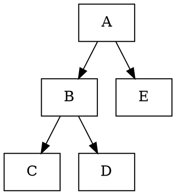
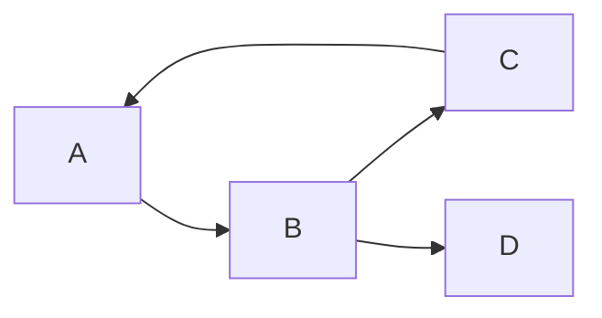
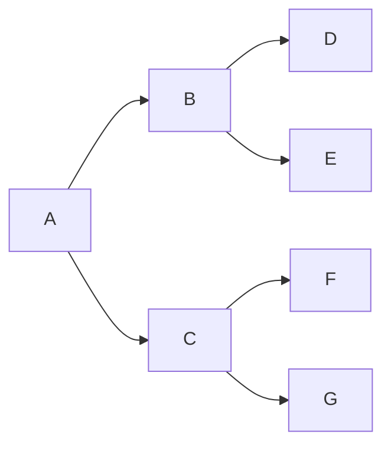

```
test
```



```sequence 
hello->hi:
Note left of hi: 你好
```

```sequence {theme="hand"}
A->>B: 你好
Note left of A: 我在左边 
Note right of B: 我在右边
B-->A: 很高兴认识你
```






* [ ] ~~*example1*~~
* [x] example2
* [ ] ~~*example3*~~**

```sequence
A->>B: 你好
Note left of A: 我在左边 
Note right of B: 我在右边
B-->A: 很高兴认识你
```

```
graph LR
A-->B
```

```
sequenceDiagram
A->>B: How are you?
B->>A: Great!
```

```
gantt
dateFormat YYYY-MM-DD
section S1
T1: 2014-01-01, 9d
section S2
T2: 2014-01-11, 9d
section S3
T3: 2014-01-02, 9d
```