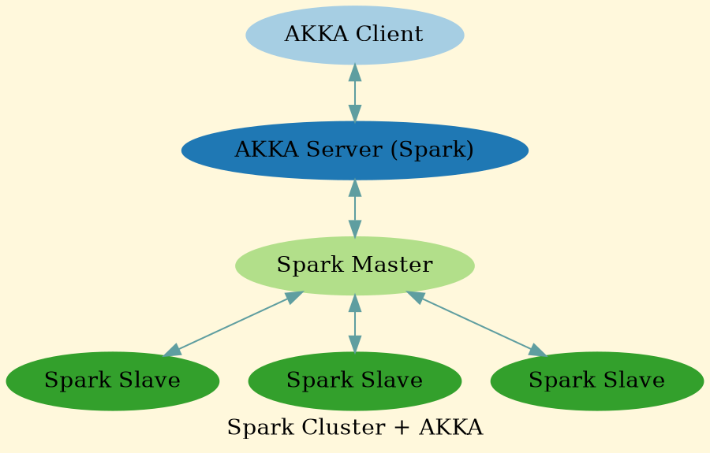

```dot
digraph G {
    bgcolor="cornsilk"
    splines="FALSE";
    size="6,6";
    label="Spark Cluster + AKKA"
    node [colorscheme=paired12, color=1, style=filled];
    
    akka_client     [label="AKKA Client", color=1]
    akka_server     [label="AKKA Server (Spark)", color=2]
    spark_master    [label="Spark Master", color=3]
    spark_slave1    [label="Spark Slave", color=4]
    spark_slave2    [label="Spark Slave", color=4]
    spark_slave3    [label="Spark Slave", color=4]
    akka_client -> akka_server -> spark_master -> spark_slave1 [dir=both color=cadetblue]
    spark_master -> spark_slave2 [dir=both color=cadetblue] 
    spark_master -> spark_slave3 [dir=both color=cadetblue]
}
```