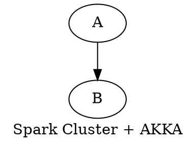
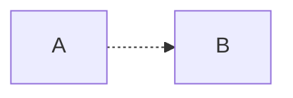
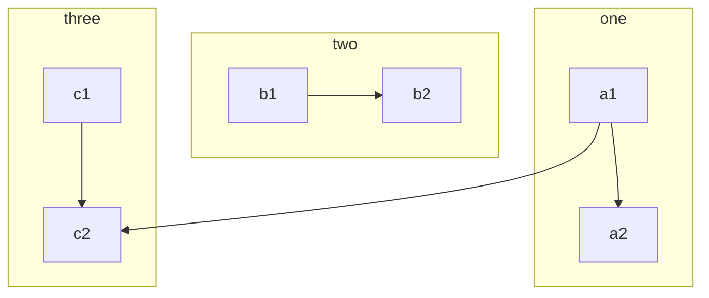

```puml
 A->B
```


```plantuml
 digraph Test {
    A->B
 }
```

```mermaid
graph TD
client1-->|read / write|SVN((SVN server))
client2-->|read only|SVN
client3-->|read / write|SVN
client4-->|read only|SVN
client5(...)-->SVN
SVN---|store the data|sharedrive
```　